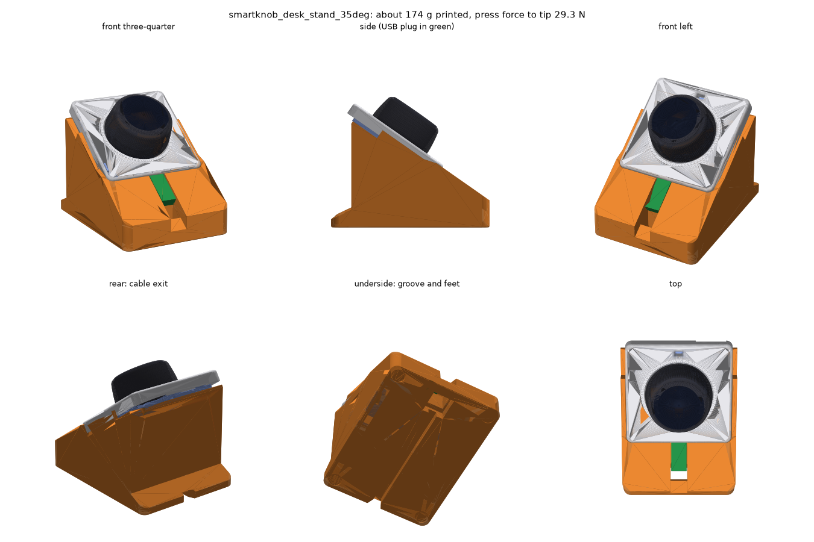

# SmartKnob Dev Kit desk stand

A 3D-printable desk stand for the SeedLabs SmartKnob Dev Kit. The knob leans back at 35° and rests on its back plate, the surface it would sit on if screwed to a wall. The stand holds it by the 85 mm front-panel skirt, so the knob cannot twist when you turn it.



## Files

| File | What it is |
|---|---|
| `smartknob_desk_stand_35deg.stl` | **Default.** Hidden cable: the USB-C plug sits in a slot, and the cable drops through a shaft and runs under the stand to the back. 93 × 123 × 82 mm. |
| `smartknob_desk_stand_compact_35deg.stl` | Smaller and faster to print. The plug sticks out of the front, and you tuck the cable into the under-floor groove. 93 × 94 × 66 mm. |
| `*.step` | The same models as STEP files, for editing in CAD. |
| `desk_stand.py` | The parametric CadQuery source. Every dimension is a parameter. |
| `check_fit.py` | Checks fit, printability and stability, and renders the previews. |
| `preview*.png` | Renders and centre-line sections of both variants. |

## Printing

- **Orientation:** flat on its base. No supports are needed. The only downward-facing surfaces are short bridges of 18 mm or less over the cable groove, the pocket and the foot recesses.
- **Settings:** PLA or PETG, 0.2 mm layers, 3 walls, 10–15 % gyroid infill.
  - Default model: roughly 110–170 g of filament depending on infill.
  - Compact model: roughly 70–110 g.
- **Fit:** the fit clearance is 0.4 mm per side. If the knob is tight, reprint with `--clear 0.5`.
- **Rubber feet:** fit four 10 mm self-adhesive feet in the recesses. Without them, a firm press can slide the stand on a smooth desk.

## Fitting the knob and cable (default model)

1. Lay the USB-C cable in the groove under the stand so it comes out at the back.
2. Thread the knob end of the cable up through the pocket and shaft at the front.
3. Plug the cable into the knob.
4. Lower the knob into the tray so the plug drops into the slot in the bottom rail.

## Design notes

- **Dimensions come from SeedLabs' own CAD** ([smartknob-hardware](https://github.com/SeedLabs-it/smartknob-hardware): `front_panel_v81`, `back_plate_v49`, `knob_shell_v57` and the KiCad board). `check_fit.py` places those meshes in the stand and reports zero interference with the knob and with a 12.4 × 7 × 26 mm USB-C plug.
- **The top edge is left open on purpose.**
  - The three Stemma QT sockets are on that edge.
  - The VEML7700 ambient-light sensor sits on the back of the PCB, near that edge, facing backwards. The firmware uses it to dim the screen and LED ring. If it were covered, the knob would think the room is dark.
- **BOOT and RST** are on the back of the PCB, near the USB edge, behind the back plate. Lift the knob out to reach them.
- **Optional screw mounting.** The back plate has four countersunk M3 holes at ±32.1 mm, meant for wall mounting, and the stand has matching 2.6 mm pilot holes. To use them:
  1. Remove the three M2 screws that hold the knob to its back plate.
  2. Screw the back plate to the stand with M3 × 8–10 mm countersunk thread-forming screws.
  3. Refit the knob.
- **Stability.** The estimate assumes a 130 g knob and a stand at ~0.35 g/cm³ effective density. On that basis the default model needs about 29 N along the knob axis to tip backwards, and the compact model does not tip. The firmware's press threshold is about 2.5 N.

## Customising

```sh
pip install cadquery trimesh manifold3d shapely matplotlib
python desk_stand.py --tilt 30                 # lower angle
python desk_stand.py --compact --tilt 40
python desk_stand.py --plug-len 32             # longer USB-C plug overmould
python desk_stand.py --no-m3-holes
python check_fit.py --cad /path/to/smartknob-hardware/cad --tilt 30
python check_fit.py --cad /path/to/smartknob-hardware/cad --table   # compare variants
```

## Not verified

- **Nothing has been printed yet.** Real-world tolerance of the SeedLabs enclosure is unknown, so check the fit on a first print.
- **Cable plug length.** `--plug-len` defaults to 26 mm of rigid overmould. Measure your cable's plug; a longer one still works in the default model but sits further over the shaft.
- **Knob mass (130 g).** This is an estimate. Only the stability figures depend on it.
